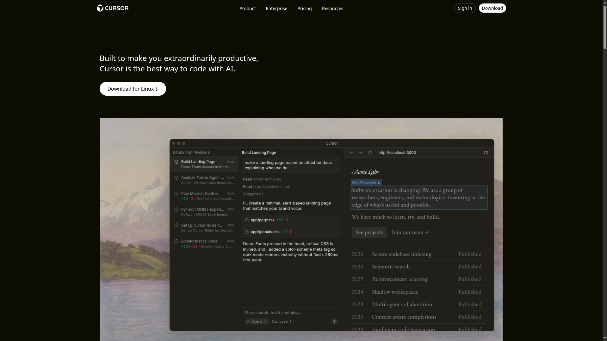
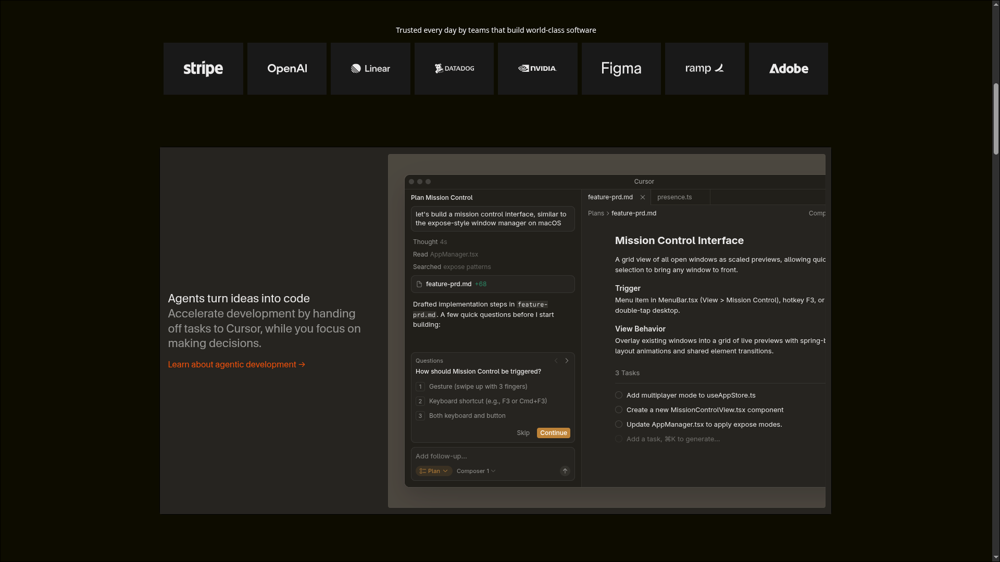
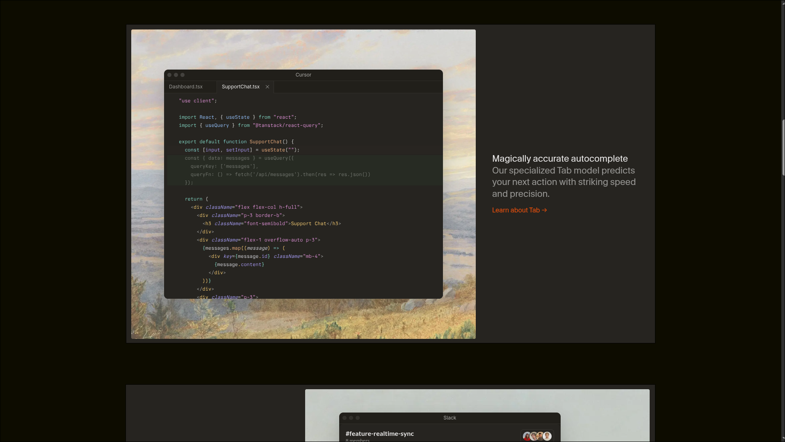
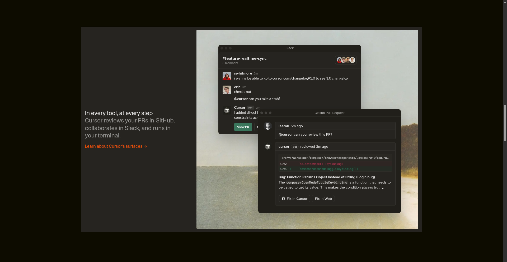
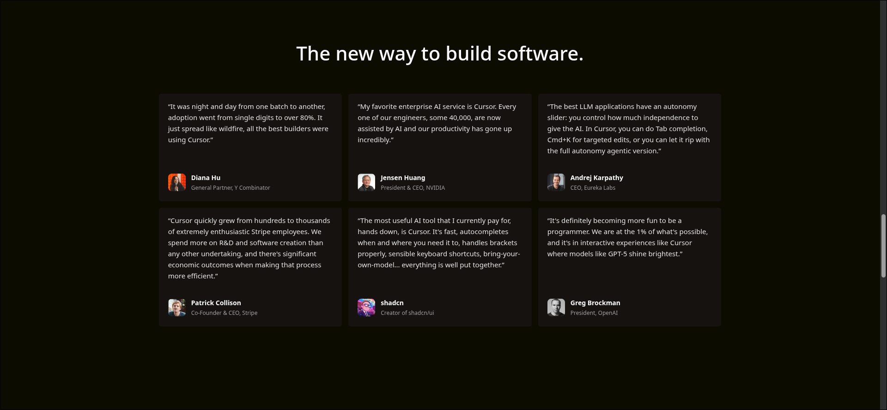
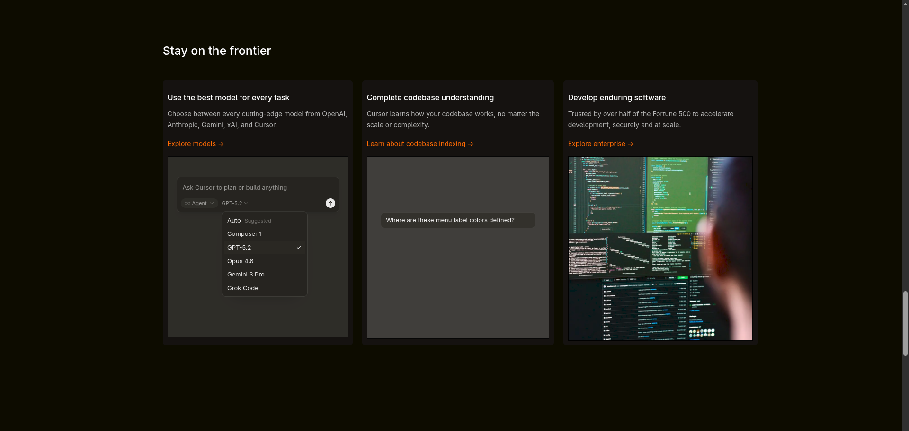
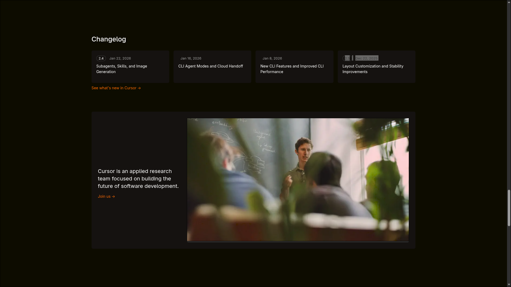
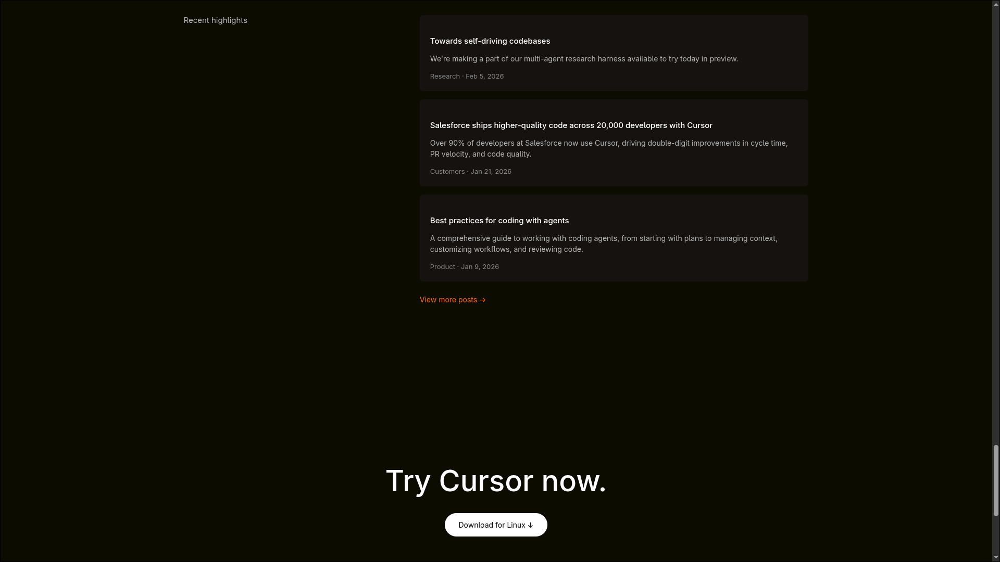
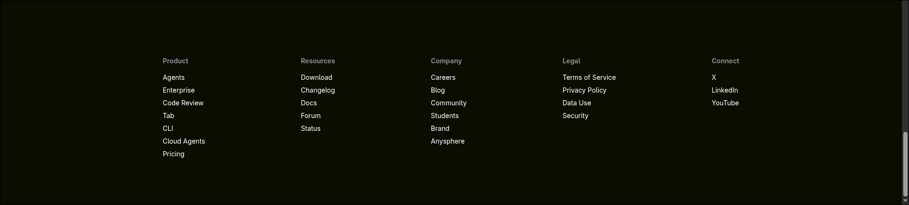

# Cursor Landing Page Clone

This project is intended for:
- Learning advanced layout techniques
- Practicing real-world UI recreation
- Portfolio demonstration

---

##  Sections created

The following sections from the original website have been recreated:

1. **Navigation Bar**
   - Logo (SVG)
   - Product navigation links
   - Sign in & Download buttons

2. **Hero Section**
   - Main headline
   - Primary download CTA
   - Product preview image

3. **Trusted By Section**
   - Grid of company logos
   - Dark card-style logo containers

4. **Feature Preview Section**
   - Large feature screenshots
   - Vertical content stacking

5. **Testimonials Section**
   - Grid-based testimonial cards
   - Author avatar, name, and role

6. **Frontier Section**
   - Three-column feature cards
   - Text + media layout

7. **Changelog Section**
   - Version badges
   - Update descriptions
   - Careers callout card

8. **Highlights / Blog Section**
   - Recent posts list
   - Category + date metadata

9. **Call to Action (CTA)**
   - Large headline
   - Download button

10. **Footer**
    - Multi-column link layout
    - Product, Resources, Company, Legal, and Social links

---

## Fonts Used

- **Primary Font:**  
  `system-ui, sans-serif`

This ensures:
- Native OS font rendering
- High performance
- Consistent appearance across platforms

---

## Color Palette

| Purpose              | Color Code |
|---------------------|------------|
| Background (Main)   | `#050400`  |
| Card Background     | `#0d0a07`  |
| Secondary Background| `#121212`  |
| Text (Primary)      | `#ffffff`  |
| Text (Muted)        | `#b5b5b5`  |
| Text (Subtle)       | `#8a8a8a`  |
| Accent / Links      | `#ff6a00`  |
| Button Background   | `#ffffff`  |
| Button Text         | `#000000`  |

---

## Demo Screenshots

### Navbar and Hero

### Trusted companies

### Features

### Features

### Testimonials

### Frontier

### Changelog

### Highlights and CTA

### Footer

